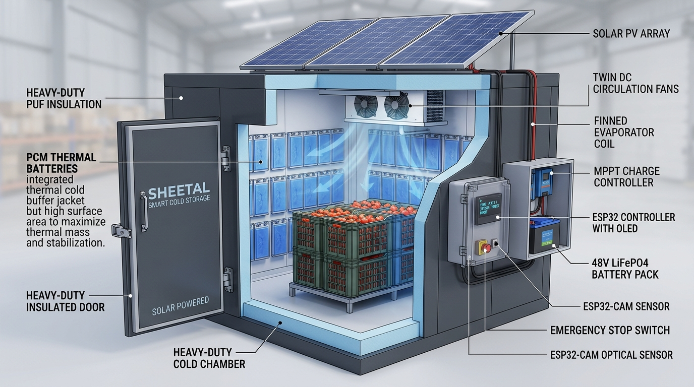

# SHEETAL

### Solar-Powered Smart Cold Storage System for Fresh Produce

**Smart India Hackathon 2026 — Hardware Edition**  
**Problem Statement ID:** SIH26005  
**Problem Title:** Solar-Powered Smart Mini Cold Storage System for Fresh Vegetables in North Eastern Region (NER)  
**Nodal Ministry:** Ministry of Development of North Eastern Region (MDoNER)  
**Theme:** Agriculture / FoodTech / Rural Development  
**Category:** Hardware  

---

## Project Verification

| Resource | Access Link | Description |
| :--- | :--- | :--- |
| **Official Repository** | [GitHub Source Code](https://github.com/TECHY-ENTHUSIAST/SHEETAL-SIH-26005.git) | Official GitHub submission repository |
| **Live Monitoring Dashboard** | [`dashboard/dashboard.html`](dashboard/dashboard.html) | Local ESP32 monitoring interface & companion dashboard |
| **Technical Design Report** | [`documentation/project_report.pdf`](documentation/project_report.pdf) | Master engineering design documentation (Stages 1–10) |
| **Engineering Calculations** | [`documentation/calculations.md`](documentation/calculations.md) | First-principles heat load, PCM, battery & solar derivations |
| **Hardware & Schematic** | [`hardware/schematic/`](hardware/schematic/) | Circuit schematic, pinout mapping & master BOM |
| **Research & Evidence** | [`research/references.md`](research/references.md) | Academic references, government data & physiological studies |
| **Demonstration Video** | [`demo/video_links.md`](demo/video_links.md) | Video walkthrough (*To be added after prototype recording*) |

---

## 1. Problem

Agricultural communities across the North Eastern Region (NER) face severe post-harvest logistical bottlenecks that result in heavy economic losses for smallholder farmers:

- **Heavy Post-Harvest Spoilage:** In Indian horticulture, post-harvest losses range from 10% to 50%. For perishables such as tomatoes, cumulative supply-chain losses average **21.51%** (ICAR-CIPHET 2022). High ambient temperatures (28°C–35°C) and humidity accelerate respiration, moisture loss, and fungal rotting within 24 to 48 hours of harvest.
- **Smallholder Scale:** Marginal and small farmers represent over 85% of cultivators in the NER, with average operational holdings of ~0.36 ha in Assam (Agriculture Census 2015-16). Individual daily marketable surpluses are small (10–25 kg per farmer), requiring village-level aggregation.
- **Inaccessible Mega-Facilities:** Conventional commercial cold rooms are centralized facilities (5,000+ metric tons) situated in distant urban centers, completely inaccessible for daily farm-gate cooling.
- **Terrain & Transport Bottlenecks:** Mountainous terrain, unpaved feeder roads, and frequent monsoon landslides extend transit times from remote villages to district markets to **12–36 hours** (and up to 72 hours during road blockages).
- **Severe Grid Vulnerability:** Rural farm clusters suffer from chronic power outages, low voltages, and un-electrified farm pockets, making grid-dependent refrigeration non-viable.
- **Distress Selling:** Lacking on-site cold storage, farmers are forced to dump their produce on middlemen at distressed prices before sunset to prevent total decay.

---

## 2. Proposed Solution

**SHEETAL** is an off-grid, modular, **solar-powered, PCM-based smart cold-storage system** engineered specifically for decentralized farm-gate and village collection center deployment.

```
┌─────────────────────────────────────────────────────────────────────────────────────────────┐
│                         SHEETAL — QUAD-BUFFER SYSTEM ARCHITECTURE                           │
├─────────────────────┬─────────────────────┬─────────────────────┬───────────────────────────┤
│ 1. ACTIVE COOLING   │ 2. THERMAL BUFFER   │ 3. ELECTRICAL BUFFER│ 4. SUPERVISORY CONTROL    │
│ R290 Refrigeration  │ Salt-Hydrate PCM    │ 51.2 V 100 Ah       │ ESP32-WROOM-32            │
│ Hermetic Compressor │ Latent Heat Storage │ LiFePO₄ Battery     │ Closed-loop monitoring,   │
│ Vapor-Compression   │ Target: ~50 kg      │ 5.12 kWh nominal    │ data logging, alarms &    │
│ System              │ PCM thermal buffer  │ energy storage      │ local Wi-Fi dashboard     │
└─────────────────────┴─────────────────────┴─────────────────────┴───────────────────────────┘
                                      │
                                      ▼
                         ┌───────────────────────────┐
                         │   INSULATED COLD CHAMBER  │
                         │   ~200 kg Fresh Produce   │
                         │   8 × HDPE Crates         │
                         │   Target: ~8 °C           │
                         └───────────────────────────┘
                                      │
                                      ▼
                         ┌───────────────────────────┐
                         │       SOLAR ENERGY        │
                         │   PV → MPPT → LiFePO₄     │
                         │   Off-grid energy supply  │
                         └───────────────────────────┘
```

### Core Operating Principles:
- **Passive Thermal Buffering (PCM):** Phase Change Material absorbs latent heat at its flat 10°C melting plateau during off-cycles, maintaining stable storage temperatures without draining batteries.
- **Renewable Solar Energy:** A 1.65 kWp solar array powers refrigeration during peak daylight hours while replenishing the 48V battery bank.
- **Supervisory Intelligence (ESP32):** An embedded ESP32 microcontroller performs continuous sensor data logging, thermal zone evaluation, compressor anti-short-cycle protection, audio-visual alerting, and serves an off-grid web dashboard.
- **Distinct System Role:** *The ESP32 does NOT directly provide refrigeration; it acts as an intelligent monitoring and supervisory controller overseeing system status.*

---

## 3. System Architecture

<p align="center">
  
  <br>
  <em>Figure 1: Isometric engineering cutaway of SHEETAL — showing 100 mm PUF insulated chamber, ventilated vegetable crates, interior perimeter wall-distributed PCM thermal buffer jacket, ceiling evaporator with dual circulation fans, IP65 ESP32 supervisory controller, 48 V LiFePO4 battery pack, and solar PV array.</em>
</p>

```
Solar Energy (1.65 kWp PV Array)
       │
       ▼
Power Management (48V MPPT Charge Controller + 48V LiFePO4 Battery + Inverter)
       │
       ▼
Cold Storage Refrigeration Loop (R290 Vapor-Compression Unit)
       │
       ▼
PCM Thermal Buffer (50 kg Encapsulated Salt Hydrate Cassettes @ 10°C)
       │
       ▼
Fresh Produce Storage Chamber (200 kg Produce / 1.44 m³ Insulated 100 mm PUF Envelope)
       │
       ▼
Instrumentation Network (DS18B20, DHT22, INA219, Door Reed Switch)
       │
       ▼
ESP32 Supervisory Controller
       ├── 0.96" SSD1306 Local OLED Display
       ├── Visual & Audible Alarm System (LED + Buzzer)
       ├── On-Board RAM CSV Data Logging
       ├── ESP32-Hosted Live Monitoring Dashboard (Wi-Fi / SoftAP)
       └── ESP32-CAM Visual Surveillance Node (UART2 Heartbeat)
```

---

## 4. Hardware Implementation

The supervisory electronics are built around the **ESP32 DevKit V1 (ESP32-WROOM-32D)**.

| Component | Purpose / Subsystem | Interface / Pin Assignment | Status |
| :--- | :--- | :--- | :--- |
| **ESP32 DevKit V1** | Supervisory controller & local web server | Micro-USB / 30-pin DIP | Verified in schematic & firmware |
| **DS18B20 Probe** | Primary storage temperature reference | `GPIO 4` (1-Wire, 4.7 kΩ pull-up) | Verified in schematic & firmware |
| **DHT22 / AM2302** | Secondary temperature & relative humidity | `GPIO 27` (Digital, 10 kΩ pull-up) | Verified in schematic & firmware |
| **Adafruit INA219** | DC voltage, current, and power monitoring | `GPIO 21` (SDA) / `GPIO 22` (SCL) | Verified in schematic & firmware |
| **SSD1306 OLED (128×64)** | Local operator status readout | `GPIO 21` (SDA) / `GPIO 22` (SCL) (`0x3C`) | Verified in schematic & firmware |
| **Piezo Buzzer** | Audible out-of-spec alarm | `GPIO 25` (PWM via `tone()`) | Verified in schematic & firmware |
| **Alert LED** | Visual out-of-spec alarm | `GPIO 26` (Digital Out, 220 Ω resistor) | Verified in schematic & firmware |
| **ESP32-CAM Node** | Crate fill level & visual monitoring | `GPIO 16` (RX2) / `GPIO 17` (TX2) | Verified in schematic & firmware |
| **Magnetic Reed Switch** | Door open / ajar safety monitoring | `GPIO 13` (Planned) | Planned; to be added to PCB |
| **AC Power Contactor** | Isolated compressor power switching | `GPIO 23` (Planned via optoisolator) | Planned; to be added to PCB |

*Full pin connections, pull-up resistances, and wiring rules are documented in [`hardware/pinout/README.md`](hardware/pinout/README.md).*

---

## 5. Temperature Monitoring Logic

The supervisory firmware applies strict threshold boundaries on storage temperature ($T_{\text{storage}}$ via DS18B20):

| Temperature Range | Firmware System Status | Alert State | Functional Purpose |
| :---: | :---: | :---: | :--- |
| **$< 6.0^\circ\text{C}$** | `COOLING PROTECT` | `LOW TEMPERATURE` | **Chilling-Injury Protection:** Inhibits compressor to prevent cell breakdown in tomatoes. |
| **$6.0^\circ\text{C} - 10.0^\circ\text{C}$** | `TARGET RANGE` | `NONE` | **Optimal Preservation:** Retards respiration and decay while safeguarding produce vitality. |
| **$10.0^\circ\text{C} - 12.0^\circ\text{C}$** | `UPPER RANGE` | `NONE` | **Acceptable Buffer:** Normal temperature during PCM latent buffering transition. |
| **$12.0^\circ\text{C} - 13.0^\circ\text{C}$** | `TRANSITION` | `WATCH TEMPERATURE` | **Early Warning:** Warns operator of thermal loading before critical rise. |
| **$\ge 13.0^\circ\text{C}$** | `HIGH TEMP ALERT` | `HIGH TEMPERATURE` | **High-Temperature Alarm:** Sounds buzzer and illuminates LED; indicates cooling failure. |

> [!NOTE]
> These temperature ranges represent **supervisory control and monitoring setpoints**, not automatically measured performance claims.

---

## 6. Phase Change Material (PCM) Thermal Buffer
 
- **Role:** Acts as a passive latent-heat battery. During sunlight hours, excess cooling solidifies the PCM. When the compressor shuts off or solar power is lost, the melting PCM absorbs wall heat leakage at a steady 10°C, holding produce safe without drawing electrical power.
- **Perimeter Wall-Integrated Architecture:** Rather than concentrating all PCM mass near the overhead fan plenum, modular slim-profile PCM cassettes line the **interior perimeter walls (side and rear walls)** of the storage chamber:
  - **Direct Boundary Interception:** Conduction heat leaking across the 100 mm PUF envelope ($U \cdot A \cdot \Delta T$) hits the perimeter PCM jacket *first* before reaching produce or internal chamber air.
  - **Enhanced Heat Transfer Area ($A$):** Distributing the PCM mass into high-aspect-ratio wall cassettes increases the effective convective and conductive surface area by $>300\%$, overcoming the low thermal conductivity of inorganic salt hydrates and achieving faster charging and discharging heat exchange rates.
  - **Natural Convective Circulation:** During compressor off-cycles or power outages when fans stop, dense cold air sinks along the perimeter PCM walls, establishing a natural convective cooling loop through the ventilated crates to prevent hotspots and temperature stratification.
- **PCM Specification:** Inorganic Salt Hydrate (Pluss savE® HS10 / IP08).
- **Nominal Phase Transition Temperature:** **10.0°C** (Phase change range: 8.0°C–12.0°C).
- **Latent Heat of Fusion ($L$):** $\approx 180\text{ kJ/kg}$ (Evidence-based from manufacturer datasheet).
- **Calculated PCM Mass:** **50 kg** split across 20 modular HDPE cassettes (2.5 kg each).
- **Stored Latent Thermal Capacity:** $50\text{ kg} \times 180\text{ kJ/kg} = 9,000\text{ kJ} \approx \mathbf{2.50\text{ kWh}_{\text{thermal}}}$.
- **Buffering Duration:**
  $$\mathbf{24\text{ to }48\text{ Hours of Thermal Buffering}} \quad \longrightarrow \quad \textbf{[Design Target — Not Yet Experimentally Validated]}$$

---

## 7. Storage Configuration & Mechanical Design

- **Nominal Storage Capacity:** **200 kg produce** *(Design Target)*.
- **Crate Configuration:** 8 to 10 standard ventilated food-grade HDPE crates (~20–25 kg capacity each).
- **Approximate Crate Dimensions:** $600\text{ mm (L)} \times 400\text{ mm (W)} \times 320\text{ mm (H)}$.
- **Internal Chamber Geometry:** $1.2\text{ m} \times 1.2\text{ m} \times 1.0\text{ m}$ (Gross Volume: $1.44\text{ m}^3$).
- **Thermal Envelope:** 100 mm rigid Polyurethane Foam (PUF) cam-lock panels ($k \approx 0.023\text{ W/mK}$, $U \approx 0.23\text{ W/m}^2\text{K}$).
- **Food-Safe Interior:** Clad with stainless steel (SS304) or pre-coated galvanized iron (PPGI) with positive-slope condensate drain trap.

---

## 8. Firmware Architecture

The ESP32 controller runs [`firmware/cold_store_controller.ino`](firmware/cold_store_controller.ino), executing the following routines:

- **Periodic Sampling (10 s interval):** Reads DS18B20 reference probe, DHT22 temperature/humidity, and INA219 electrical bus telemetry.
- **Plausibility & Fault Detection:** Detects sensor disconnections (`DEVICE_DISCONNECTED_C` or out-of-range readings) and raises diagnostic alerts (`DS18B20 FAULT`, `DHT22 FAULT`, `INA219 FAULT`).
- **Low-Voltage Protection Alert:** Warns if DC system bus voltage drops below $4.75\text{ V}$.
- **Local Display Refresh (1 s interval):** Updates the 0.96" SSD1306 OLED display with live temperatures, humidity, bus voltage, current, and alert status.
- **Visual Node Heartbeat:** Monitors ESP32-CAM UART2 serial interface at 115200 baud for `CAM_OK` heartbeat packets (flags timeout if silent > 60 s).
- **Embedded Web Server:** Serves the live web monitoring dashboard directly from RAM/PROGMEM on port 80.
- **Data Logging:** Maintains a rolling 24-entry historical record in RAM, downloadable as formatted CSV via `/api/history`.
- **Network Resilience & SoftAP Fallback:** Attempts connection to pre-configured Wi-Fi networks; if unavailable, automatically spins up a local fallback Access Point:
  - **SSID:** `ColdStore-Setup`
  - **Password:** `coldstore26005`
  - **Default IP:** `http://192.168.4.1`

---

## 9. Monitoring Dashboard

### ESP32-Hosted Live Monitoring Dashboard
The primary dashboard is hosted directly by the ESP32 microcontroller:
- **No Internet Required:** Works completely off-grid on the local Wi-Fi / SoftAP network.
- **Displayed Metrics:** Storage Temperature (°C), Humidity (%), System Voltage (V), Current (mA), Power (mW), System Status, Active Alerts, Camera Heartbeat, and CSV export.
- **Companion Client (`dashboard.html`):** An optional single-page application in [`dashboard/dashboard.html`](dashboard/dashboard.html) provides dark-theme visualization, live gauges, and rolling multi-axis Chart.js trend graphs.

> [!IMPORTANT]
> This repository contains **NO cloud dashboard or externally hosted website**. All monitoring is performed locally by the embedded hardware.

---

## 10. Hardware Documentation

- **Schematic Diagram:** [`hardware/schematic/README.md`](hardware/schematic/README.md)
- **Pinout Mapping:** [`hardware/pinout/README.md`](hardware/pinout/README.md)
- **Wiring Specifications:** [`hardware/wiring/README.md`](hardware/wiring/README.md)
- **Master Bill of Materials (BOM):** [`hardware/BOM/README.md`](hardware/BOM/README.md)
- **Hardware Photographs:** [`images/hardware/`](images/hardware/)

---

## 11. Testing & Validation

### 11.1 Prototype Measurements
- Microcontroller boot sequence, sensor bus initialization, local SoftAP creation, and web API responses have been verified on the electronics test bench.
- *Chamber thermal pull-down data:* **None recorded yet** (see [`testing/test_results.csv`](testing/test_results.csv)).

### 11.2 Engineering Calculations
- **Sensible Produce Pull-down Energy (200 kg, 30°C to 10°C):** $4.43\text{ kWh}_{\text{thermal}}$.
- **Envelope Conduction Loss (100 mm PUF, 24 h):** $1.23\text{ kWh}_{\text{thermal}}$.
- **Total Working Daily Thermal Load:** $6.30\text{ kWh}_{\text{thermal}}/\text{day}$.
- **PCM Latent Thermal Energy Stored (50 kg):** $2.50\text{ kWh}_{\text{thermal}}$ ($9,000\text{ kJ}$).
- **Battery Autonomy at 300 W equivalent load:** $\approx 11.5\text{ Hours}$ ($48\text{ V } 100\text{ Ah LiFePO}_4$).
- **Minimum Required Solar PV Array:** $1.19\text{ kWp}$ (Practical selected array: $1.65\text{ kWp}$).

### 11.3 Design Targets
- Produce storage capacity: 200 kg fresh produce.
- Temperature setpoint: 10.0°C (safe range 8°C–12°C).
- Relative humidity: 90%–95% RH.
- Passive thermal holdover: 24 to 48 Hours.

### 11.4 Not Yet Validated (Requires Physical Chamber Testing)
1. **24–48 Hours Thermal Buffering Duration:** Requires physical execution of Stage 9 TEST-07 (power-failure holding test).
2. **Refrigeration System Working COP of 2.0:** Requires test-bench thermal calorimetry and power logging.
3. **Chamber Temperature Uniformity within ±1.0 K:** Requires 3-tier crate probe verification under forced airflow.
4. **Autonomous Solar Operation During 72 h Monsoon Overcast:** Requires continuous multi-day field test.

---

## 12. Quick Start Guide

To replicate the supervisory monitoring electronics on an Arduino test bench:

### 1. Hardware Requirements
- 1× ESP32 DevKit V1 (30-pin)
- 1× DS18B20 waterproof digital temperature sensor (with 4.7 kΩ resistor)
- 1× DHT22 relative humidity sensor (with 10 kΩ resistor)
- 1× Adafruit INA219 power monitoring breakout
- 1× SSD1306 0.96" I2C OLED display (128×64)
- 1× 5 mm Red LED + 220 Ω resistor
- 1× 5V Piezo buzzer
- Solderless breadboard & jumper wires

### 2. Software Setup
1. Install **Arduino IDE** (v2.x recommended).
2. Install the **ESP32 Board Package** (`esp32` by Espressif Systems).
3. Install required libraries via Arduino Library Manager (see [`firmware/libraries.md`](firmware/libraries.md)):
   - `DallasTemperature`
   - `OneWire`
   - `DHT sensor library` (and `Adafruit Unified Sensor`)
   - `Adafruit INA219`
   - `Adafruit SSD1306` (and `Adafruit GFX Library`)

### 3. Wiring Connections
- Connect DS18B20 data line to `GPIO 4` (with 4.7 kΩ pull-up to 3.3V).
- Connect DHT22 data line to `GPIO 27` (with 10 kΩ pull-up to 3.3V).
- Connect shared I2C bus: `SDA` to `GPIO 21`, `SCL` to `GPIO 22` (OLED & INA219).
- Connect Buzzer (+) to `GPIO 25`, (-) to `GND`.
- Connect LED anode to `GPIO 26` through a 220 Ω resistor, cathode to `GND`.

### 4. Upload & Operation
1. Open [`firmware/cold_store_controller.ino`](firmware/cold_store_controller.ino) in Arduino IDE.
2. Select board **DOIT ESP32 DEVKIT V1** and your COM port.
3. Click **Upload**.
4. Open **Serial Monitor** at **115200 baud**.
5. Connect your smartphone or computer to the Wi-Fi network shown (or to SoftAP `ColdStore-Setup` with password `coldstore26005`).
6. Navigate to `http://192.168.4.1` (or the printed local IP) to view the live dashboard.

---

## 13. Team & Institutional Information

- **Institution:** `Thakur Shree D.P.S College Of Engineering & Management`
- **Team Name / ID:** `128664`

---


