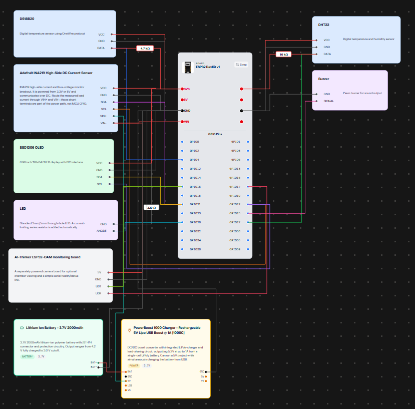

# Schematic & Circuit Architecture

This directory contains the schematic documentation for the **SHEETAL** supervisory monitoring and instrumentation circuit.

---

## 1. Schematic Diagram

The current prototype schematic diagram is recorded below:

*Source capture: `schematic_2026-09-27.png` (captured from prototype hardware design capture).*

---

## 2. Subsystem Functional Breakdown

The prototype circuit is organized into five main electrical functional blocks:

### Block 1: Supervisory Microcontroller (ESP32 DevKit V1)
- **Part:** ESP32-WROOM-32D (30-pin development board)
- **Role:** Real-time sensor sampling, data logging, thermal zone evaluation, threshold alert generation, OLED driving, and running the local HTTP server.
- **Operating Voltage:** 3.3V logic (on-board AMS1117-3.3V LDO regulator fed from 5V rail).

### Block 2: Storage Thermal & Environmental Sensing
- **DS18B20 Digital Temperature Sensor:** Primary chamber/produce temperature reference. 1-Wire interface connected to `GPIO 4` with a 4.7 kΩ pull-up resistor to 3.3V. Waterproof stainless-steel probe rated for high-humidity environments.
- **DHT22 / AM2302 Sensor:** Secondary air temperature and relative humidity monitoring. Single-bus digital line connected to `GPIO 27` with a 10 kΩ pull-up resistor to 3.3V.

### Block 3: Power Monitoring & Local Display (Shared I²C Bus)
- **INA219 High-Side Power Monitor:** Measures DC bus voltage, current shunt drop, and computes instantaneous power consumption over I²C (`SDA: GPIO 21`, `SCL: GPIO 22`).
- **SSD1306 0.96" OLED Display:** 128×64 monochrome OLED providing instantaneous at-a-glance local field readings on the same shared I²C bus at address `0x3C`.

### Block 4: Operator Alert Subsystem
- **Audible Alert (Piezo Buzzer):** Connected to `GPIO 25`, driven via PWM / `tone()` (2200 Hz, 180 ms pulse interval on active alert condition).
- **Visual Alert (LED):** Connected to `GPIO 26` via a 220 Ω current-limiting resistor, illuminated on active alert.

### Block 5: Visual Surveillance Node (ESP32-CAM Interconnect)
- **ESP32-CAM Communication Interface:** Dedicated UART2 serial link (`CAM_RX_PIN 16` ← CAM `U0T`, `CAM_TX_PIN 17` → CAM `U0R`) operating at 115200 baud, 8N1. The controller monitors a periodic `CAM_OK` heartbeat from the camera node.

---

## 3. Power Supply Architecture (Bench Prototype vs Full System)

- **Benchtop Electronics Prototype:** The current schematic reflects a self-contained monitoring rig powered by a 3.7 V 2000 mAh Li-ion rechargeable cell paired with an Adafruit PowerBoost 1000C step-up charger supplying regulated 5 V to the ESP32 and display rail.
- **Full Field System Architecture:** In the complete deployed unit, low-voltage power for the ESP32 and instrumentation is derived directly from the main 48 V LiFePO4 battery bank via a high-efficiency 48 V → 12 V / 5 V synchronous DC-DC buck converter.

---

## 4. Planned Actuation Additions (Not in Bench Schematic)

The following actuator connections are specified in the system architecture and will be added to the PCB layout in the next hardware revision:
- **Compressor AC Contactor Driver:** Optocoupled switching circuit to isolate inductive motor kickback from the digital logic.
- **Evaporator Fan Control:** Low-side N-channel MOSFET circuit for PWM speed regulation of the 12 V DC circulation fans.
- **Door Status Detection:** Magnetic reed switch connected to a digital interrupt pin with pull-up resistor.
