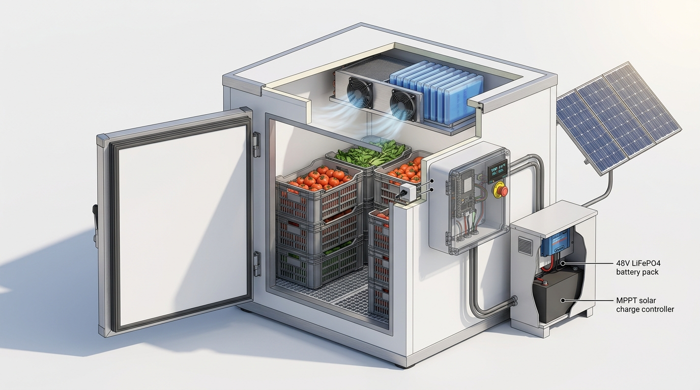

# Prototype 3D Concept & Engineering Architecture

This directory contains visual prototype designs and renders representing the physical architecture of **SHEETAL** (SIH 2026 Problem Statement PS 26005).

---

## 1. 3D Prototype Render & Cutaway Architecture

### Subsystem Visual Callouts:

1. **Insulated Cold Storage Chamber Enclosure:**
   - 100 mm continuous rigid Polyurethane Foam (PUF) insulation panels ($k \approx 0.023\text{ W/mK}, U \approx 0.23\text{ W/m}^2\text{K}$).
   - Heavy-duty hinged cold-room door with double magnetic perimeter gaskets to eliminate thermal bridging and infiltration.
   - Raised floor grating with sloped condensate drainage sump.

2. **Crop Storage Configuration:**
   - Stacked food-grade high-density polyethylene (HDPE) ventilated crates (200 kg nominal capacity).
   - Reference crop: fresh harvest tomatoes (*Solanum lycopersicum*) and compatible moderate-temperature produce.

3. **Active Refrigeration & PCM Thermal Battery:**
   - Overhead forced-draft evaporator unit with dual 12 V DC circulation fans.
   - 10 modular Phase Change Material (PCM) cassettes (25 kg inorganic salt hydrate, 10.0°C nominal transition) arranged in the overhead discharge plenum for convective thermal charging and off-cycle passive buffering.

4. **Supervisory Control & Automation Unit (IP65 Enclosure):**
   - ESP32-WROOM-32D supervisory controller executing closed-loop thermal monitoring, anti-short-cycle protection, and local web serving.
   - External 0.96" I²C OLED local status readout and alert indicators.
   - Emergency stop push button for complete electrical isolation.
   - Optical ESP32-CAM monitoring node observing internal produce inventory and crate fill level.

5. **Off-Grid Power Conditioning & Storage:**
   - 48 V, 100 Ah Lithium Iron Phosphate (LiFePO4) battery pack (4.80 kWh nominal capacity).
   - 48 V / 50 A MPPT solar charge controller.
   - Interconnected to external 1.65 kWp monocrystalline solar photovoltaic (PV) array.

---

*Note: High-resolution photographs of the physical manufactured prototype will also be added to this directory during Stage 9 field commissioning.*
